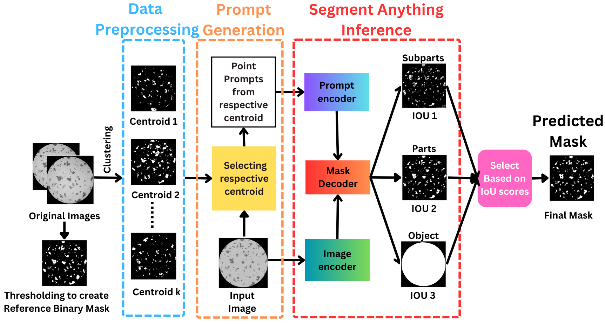

# Unsupervised  promptable porosity segmentation In laser powder bed fusion by SAM

This repository contains code for the [An unsupervised approach towards promptable porosity segmentation in laser powder bed fusion by segment anything](https://www.nature.com/articles/s44334-025-00021-4)-a novel framework built on top of the Segment Anything Model (SAM). It focuses on **unsupervised prompt generation from the data** to perform **weakly supervised porosity segmentation** without any supervised fine-tuning. The scripts are modular and support different stages of the pipeline such as clustering and segmentation.

##  Framework Overview


##  Repository Contents

| File | Description |
|------|-------------|
| `data_preprocessing_kmeans.py` | Performs unsupervised clustering (K-means) of images of each 3D printed sample. Clusters the data and collects the centroid images. |
| `data_preprocessing_kmeds.py` | Performs unsupervised clustering (K-medoids) of images of each 3D printed sample. Clusters the data and collects the medoid images. |
| `GT_prompts_SAM.py` | Uses pseudo ground truths or reference binary masks to generate prompts for comparing performance with centroid-based prompts. |
| `Prompt_gen_SAM_IoT_thresh.py` | Uses the centroid/medoid images to generate prompts, performs SAM inference on the clustered data, and applies predicted IoT score thresholding to collect the most accurate mask. Also computes the Dice Similarity Score. |

##  How to Use

1. **Cluster data and collect centroid images**
   ```bash
   python data_preprocessing_kmeans.py
   ```
 **Or to collect medoid images**
  ```bash
   python data_preprocessing_kmeds.py
   ```
2. **Generate Prompts, run SAM on clustered data, generates masks **
   ```bash
   python Prompt_gen_SAM_IoT_thresh.py
   ```
3. **Generate prompts from pseudo ground truth**
   ```bash
   python GT_prompts_SAM.py
   ```
> ⚠️ Make sure to configure file paths or parameters in each script based on your data location and clustering setup.

## Requirements

- Python >= 3.8  
- PyTorch  
- OpenCV  
- NumPy  
- scikit-learn  
- [Segment Anything (SAM)]


## 📄 License

Released under the [MIT License](LICENSE).

##  Author

Maintained by [Israt Zarin Era](https://github.com/IE0005)
